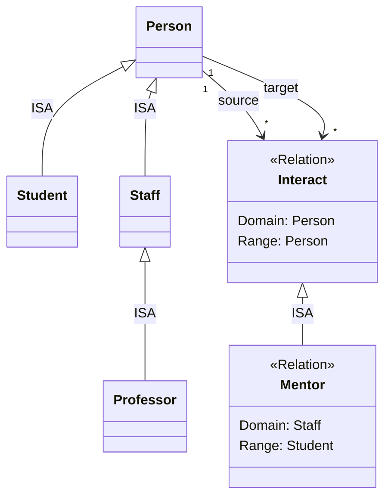

# Proof-of-Concept: Concept Inference System

## 1. Description of Domain Fragment

We selected a fragment of a **University** domain focusing on mentorship relationships.

### Concepts (Concepts)
*   **Person**: Abstract entity representing a human being.
*   **Student**: A person enrolled in studies.
*   **Staff**: A person employed by the university.
*   **Professor**: A senior academic staff member.

### Hierarchy
*   `Student` **ISA** `Person`
*   `Staff` **ISA** `Person`
*   `Professor` **ISA** `Staff`

### Relations
*   **Interact**: A generic interaction between two persons.
*   **Mentor**: A specific relationship where a Staff member mentors a Student.
    *   `Mentor` **ISA** `Interact`

## 2. ER Diagram

## 3. Abstract Data Types (ADT) Implementation

The implementation is provided in `concepts.py` using Python.

*   **KripkeScale**: Represents the "T-Box" or ontology, managing the hierarchy of concepts and relations.
*   **Concept**: Represents a type/class with support for transitive `ISA` checks.
*   **Relation**: A specialized Concept connecting a Domain and Range.
*   **PossibleWorld**: Represents the "A-Box" or state, containing a specific set of instances and links.
*   **Frame**: Represents an Instance of a Concept.
*   **Link**: Represents an Instance of a Relation.

## 4-8. Execution & Verification

The script `concepts.py` performs the following:
1.  Defines the concepts and hierarchy.
2.  Defines relations and their hierarchy.
3.  Creates a "Possible World" (Semester 1).
4.  Instantiates objects (Alice: Student, Bob: Professor).
5.  **Verifies `instance-of` on Concepts**:
    *   Checks if Bob is a Person (True, via Professor -> Staff -> Person).
6.  Instantiates a link (Bob mentors Alice).
7.  **Verifies `instance-of` on Relations**:
    *   Checks if the "Mentor" link is considered an "Interact" instance (True, via Mentor -> Interact).
