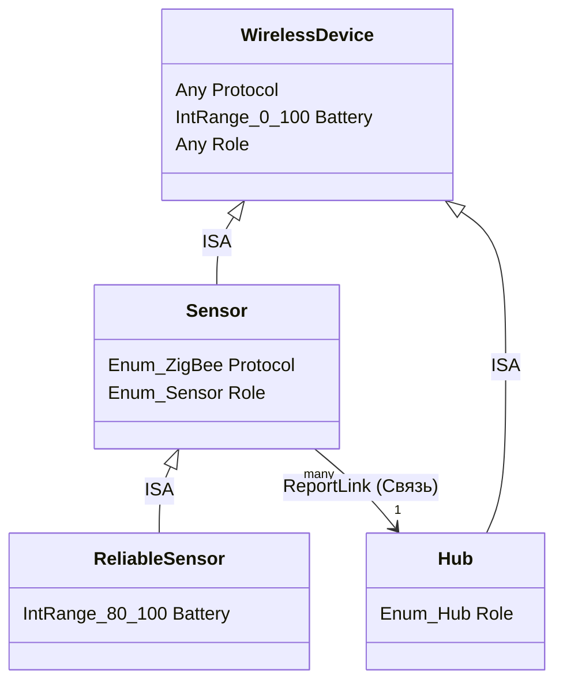

# Система вывода на концептах (Умный дом)

## Описание предметной области

Для демонстрации работы системы выбрана область IoT (Умный дом).

### Концепты

- **Атомарные концепты (Атрибуты)**:
  - Protocol - протокол связи (WiFi, ZigBee и др.).
  - Battery - уровень заряда (0-100).
  - Role - роль устройства (Датчик, Хаб).
- **Составные концепты**:
  - WirlessDevice - любое устройство, имеющее протокол, заряд и роль.
  - Sensor - Устройство с протоколом ZigBee и ролью Sensor.
  - ReliableSensor: Датчик (Sensor) с высоким уровнем заряда (80-100%).
  - Hub - Устройство с ролью Hub.

### Иерархия (ISA)

- Sensor ISA WirelessDevice (сужение допустимых значений протокола и роли)
- ReliableSensor ISA Sensor (Сужение допустимого интервала заряда батареи)
- Hub ISA Device (сужение роли до значения Hub)

### Связи (Relations)

- Connection - Базовая связь между любыми двумя устройствами.
- CriticalReport - Отчет от надежного датчика к хабу .

## ER-диаграмма

