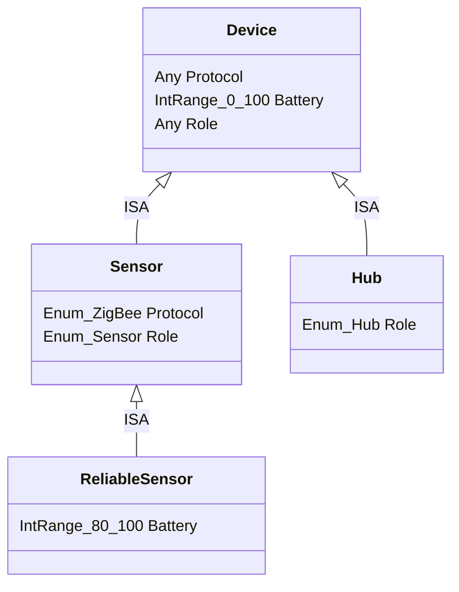

# Система вывода на концептах (Умный дом)

## Описание предметной области

Для демонстрации работы системы выбрана область IoT (Умный дом).

### Концепты

- Атомарные концепты (Атрибуты):
  - Protocol - протокол связи (WiFi, ZigBee и др.).
  - Battery - уровень заряда (0-100).
  - Role - роль устройства (Датчик, Хаб).
- Составные концепты:
  - Device - любое устройство, имеющее протокол, заряд и роль.
  - Sensor - Устройство с протоколом ZigBee и ролью Sensor.
  - ReliableSensor - Датчик (Sensor) с высоким уровнем заряда (80-100%).
  - Hub - Устройство с ролью Hub.

### Иерархия (ISA)

- Sensor ISA Device (сужение допустимых значений протокола и роли)
- ReliableSensor ISA Sensor (Сужение допустимого интервала заряда батареи)
- Hub ISA Device (сужение роли до значения Hub)

### Фреймы

Фреймы описывают взаимодействия между объектами. Фрейм состоит из набора аргументов, каждый из которых имеет имя переменной, семантическую роль (из перечисления Role) и тип (концепт, которому должен соответствовать объект).

Операция пересечения:
Позволяет объединять фреймы. Если у фреймов есть аргументы с одинаковым именем и ролью, их типы пересекаются. Уникальные аргументы добавляются в результирующий фрейм. 

Примеры фреймов:

1. Control (Controller->actor: Hub, Managed->target: Device) - хаб управляет устройством.
2. Topology (Managed->target: Device, Gateway->gateway: Hub) - устройство подключено через шлюз.
3. SensorTarget (Managed->target: Sensor) - ограничитель, требующий, чтобы цель была сенсором.

Результат пересечения:

- RoutedControl = Control & Topology. Аргументы: actor, gateway и общий target.
- SecureRoutedControl = RoutedControl & SensorTarget. Тип аргумента target сужается до Sensor.

### Возможные миры и Шкала Крипке

- PossibleWorld - хранит набор инстансов концептов и инстансов фреймов.
- KripkeStructure - связывает миры отношением достижимости. Позволяет запрашивать экстенсионал концепта с учетом всех экземпляров в достижимых мирах.

## Диаграмма предметной области показвающая IsA отношения

## Примеры использования (Сценарий)

1. Определение концептов - создаются базовые типы устройств и их специализации.
2. Проверка ISA - система подтверждает логические связи между концептами (ReliableSensor это Sensor).
3. Создание миров - в мир Home добавляются физические устройства (хабы, датчики).
4. Проверка инстансов-  проверяется соответствие данных объектов заданным концептам.
5. Работа с фреймами:
   - Создается сложный трехместный фрейм RoutedControl путем пересечения двухместных фреймов управления и топологии;
   - Создается инстанс этого фрейма, связывающий три конкретных объекта;
   - Валидация: Система блокирует создание инстанса, если объект в роли цели не является сенсором (для фрейма SecureRoutedControl).
6. Шкала Крипке - lемонстрируется поиск объектов в сети миров (например, поиск всех исправных датчиков во всех комнатах).
